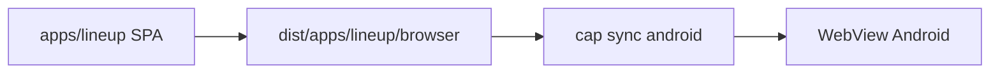

# Shell nativo de Lineup (Capacitor)

El binario de Android carga la aplicación web `lineup` tal cual: mismas rutas, mismas pantallas PrimeNG y los mismos estilos. Capacitor solo abre un WebView, copia el build del navegador y lo muestra. No hay una segunda interfaz hecha con componentes Ionic.

`apps/mobile` sigue siendo un placeholder (`home-page works!`). No se empaqueta. Los comandos de este documento se ejecutan desde `frontend/lineup`, no desde `backend/lineup`.

## Qué es el shell

Un shell de Capacitor es el proyecto nativo (`android/` e `ios/`) que envuelve la web. En Android, `MainActivity` extiende `BridgeActivity`: crea el WebView, sirve los archivos estáticos y expone los plugins nativos.

La interfaz que ve el usuario es la de `apps/lineup`. Ionic queda instalado en el monorepo, pero las vistas del APK no usan `ion-header`, `ion-tabs` ni `ion-list`.



El origen del WebView en Android es `https://localhost`, porque `capacitor.config.ts` fija `server.androidScheme` en `https`. Ese origen ya está permitido por CORS en los API de usuarios, negocios y sockets, y las cookies de sesión salen con `SameSite=None; Secure`.

## Implementación

### Build estático

La web publicada sigue siendo SSR (`outputMode: "server"`). El teléfono no ejecuta el servidor Express, así que la configuración `mobile` de `apps/lineup/project.json` genera solo el navegador:

- `server: false`, `ssr: false`, `prerender: false`
- `outputMode: "static"`
- salida en `dist/apps/lineup/browser`

Esa configuración sustituye `apps/lineup/src/app/shell-target.ts` por `shell-target.mobile.ts`. En el build nativo `isNativeShellBuild` vale `true` y `app.config.ts` no registra `provideClientHydration`. El build web y el SSR no cambian.

`capacitor.config.ts` apunta el shell a ese directorio:

```ts
webDir: 'dist/apps/lineup/browser';
```

### Comandos

Desde `frontend/lineup`:

```sh
npm run build:mobile:lineup
npm run cap:sync:android
```

`build:mobile:lineup` ejecuta `nx run lineup:build:mobile`. `cap:sync:android` copia `dist/apps/lineup/browser` a `android/app/src/main/assets/public` y actualiza la config nativa. Esos assets están en `.gitignore`; hay que sincronizar después de cada build.

El APK de depuración queda en `android/app/build/outputs/apk/debug/app-debug.apk`. También se puede abrir `android/` en Android Studio.

En Windows solo se compila Android. El proyecto `ios/` está generado; compilarlo requiere macOS y Xcode.

### Botón atrás

`NativeShellService` (`apps/lineup/src/app/core/services/native-shell.service.ts`) escucha `backButton` de `@capacitor/app` únicamente cuando `Capacitor.isNativePlatform()` es verdadero. Si el WebView tiene historial, llama a `Location.back()`. Si no, cierra la app. En el navegador el servicio no registra nada. La raíz de la app lo engancha en `ngAfterViewInit` y lo suelta en `ngOnDestroy`.

## Ventajas

- Una sola base de pantallas. Un cambio en `apps/lineup` llega al APK con build y `cap sync`. No hay que copiar las vistas a `apps/mobile`.
- La experiencia es la de la web: PrimeNG, Tailwind, guards, Apollo y las mismas URLs.
- El shell nativo se mantiene pequeño. El código de plataforma se limita al botón atrás y a la configuración de Capacitor.
- La sesión existente sirve para el WebView. Las peticiones van con `withCredentials` hacia los API en `https://*.api.lineup.com.ve`, y el origen `https://localhost` ya está aceptado.
- El build web con SSR no se toca. La hidratación solo se omite en la configuración `mobile`.

## Limitaciones

- No es una app con aspecto nativo de Ionic. Sidebars, tablas y formularios anchos se comportan como la web responsive.
- `apps/mobile` no forma parte del binario. Servir ese proyecto (`npx nx serve mobile`) muestra el placeholder, no Lineup.
- iOS no se genera desde Windows. `cap sync android` no actualiza un IPA.
- Cada cambio de la web exige volver a compilar y sincronizar. El APK no apunta al servidor de desarrollo.
- El inicio de sesión con Google sigue siendo el botón web de Google Identity Services. Google suele bloquearlo dentro de un WebView. El login con correo es el que usa este shell. Un flujo nativo (`@capacitor/browser` o el plugin de Google) no está incluido.
- No hay icono de tienda, splash definitivo, push notifications ni publicación en Play Store o App Store.
- Descarga de PDF, selección de archivos, mapas y el socket de notificaciones dependen de lo que el WebView permita. Si algo falla solo ahí, se corrige ese punto; no se reescribe la pantalla.
- El AVD `Medium_Phone_API_36.1` de esta máquina entra en pánico del kernel al arrancar. La comprobación se hizo en un emulador limpio. En un dispositivo físico o en otro AVD el APK se instala igual.

## Comprobación hecha

En un emulador Android, el WebView abrió la home de Lineup y estas rutas respondieron como en la web: búsqueda, landing, términos, privacidad, login, registro de usuario y de negocio, ficha de negocio y ficha de producto. Perfil y panel, sin sesión, redirigen a login. El botón atrás volvió de `/register/user` a `/register`.

Una petición de login lanzada desde el propio WebView (`Origin: https://localhost`, `credentials: include`) llegó al API de usuarios. No hizo falta cambiar CORS ni las cookies.
